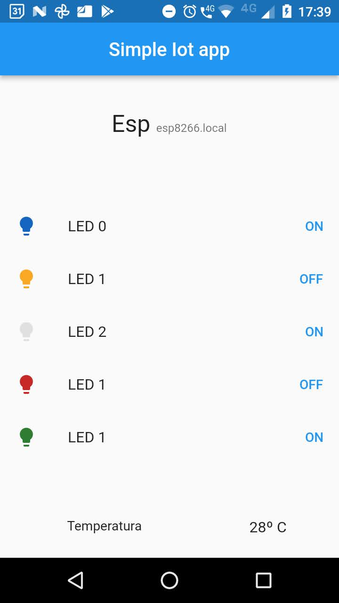

# IOT app

Aplicativo criado para a quinta prática da disciplina IOT, mas ao invés
de criar o app usando MIT App Inventor, foi utilizado o framework Flutter.

Ele faz requests em ip __hardcoded__ no  [http esp service](lib/esp_sensors/esp_service/http_esp_service.dart).
Onde esse ip é o ip do esp na rede.

ele faz 3 tipos de requests:
- _GET_ http://ip_do_esp/api/leds  
- _GET_ http://ip_do_esp/api/temperature
- _POST_  http://ip_do_esp/api/leds


Através do acelerômetro do smartPhone ele busca acender um led amarelo

Para entender mais sobre como está sendo feito os requests veja os testes do [esp service](test/esp_sensors/esp_service/esp_service_test.dart).

Como todo projeto flutter, para executar os testes rode:
```shell
flutter pub run build_runner build --delete-conflicting-outputs # gerando os mocks com mockito
flutter test
```

# Uma carinha do App

